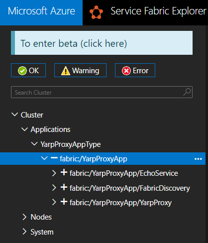

# YARP Reverse Proxy for Service Fabric integration

## Pre-reqs

* Windows 10 Version 1909 or later, x64
* .NET SDK (version indicated in global.json)
* .NET Core 3.1 runtime (to run netcoreapp3.1 tests)
* To setup certs, use `eng/Create-DevCerts.ps1`.

Dotnet sdks and runtimes can be downloaded from https://dotnet.microsoft.com/download .

## Building and unit testing

1. dotnet build dirs.proj
2. dotnet test dirs.proj
3. dotnet pack dirs.proj

For unit tests, you may want to filter out some tests. Refer to [the docs](https://docs.microsoft.com/en-us/dotnet/core/tools/dotnet-vstest?tabs=netcore21) for information on how to use them. Example:

```cmd
dotnet test dirs.proj --filter HttpProxyTest
```

Alternatively, you can also open `YarpSF.sln` at the root of the repo with Visual Studio 2019.
Running builds and unit tests from VS2019 is supported (verified with Visual Studio 2019 16.10.2+ .NET 5 SDK version 5.0.201).

## Project structure

This repo includes:

* `YarpProxyApp`: an example Service Fabric application, consisting of:
  * `YarpProxy.Service`: The runtime component that implements a Reverse Proxy using YARP. It reads configurations from remote service `FabricDiscovery.Service`
  * `FabricDiscovery.Service`: Responsible for discovering Service Fabric services that are configured to use YARP via Service Manifest Extensions, and exposes the summarized configurations for `YarpProxy.Service` to consume in real-time
  * `EchoService`: An example service that is configured to use YARP and can be called in End-to-End tests to verify functionality.

## Running locally

* Deploy `YarpProxyApp` to the local cluster
* Observe in Service Fabric Explorer that the application starts and all 3 services are running without errors:

  

* Using a browser, access `https://localhost/api/echo`. If all works, you should get a `200 OK` response with contents resembling the following:

   ```json
   {
     "message": "Hello from EchoService",
     "serverTime": "2021-07-23T23:05:17.37+00:00"
   }
   ```

## Contributing

This project welcomes contributions and suggestions.  Most contributions require you to agree to a
Contributor License Agreement (CLA) declaring that you have the right to, and actually do, grant us
the rights to use your contribution. For details, visit https://cla.opensource.microsoft.com.

When you submit a pull request, a CLA bot will automatically determine whether you need to provide
a CLA and decorate the PR appropriately (e.g., status check, comment). Simply follow the instructions
provided by the bot. You will only need to do this once across all repos using our CLA.

This project has adopted the [Microsoft Open Source Code of Conduct](https://opensource.microsoft.com/codeofconduct/).
For more information see the [Code of Conduct FAQ](https://opensource.microsoft.com/codeofconduct/faq/) or
contact [opencode@microsoft.com](mailto:opencode@microsoft.com) with any additional questions or comments.

## Trademarks

This project may contain trademarks or logos for projects, products, or services. Authorized use of Microsoft 
trademarks or logos is subject to and must follow 
[Microsoft's Trademark & Brand Guidelines](https://www.microsoft.com/en-us/legal/intellectualproperty/trademarks/usage/general).
Use of Microsoft trademarks or logos in modified versions of this project must not cause confusion or imply Microsoft sponsorship.
Any use of third-party trademarks or logos are subject to those third-party's policies.
