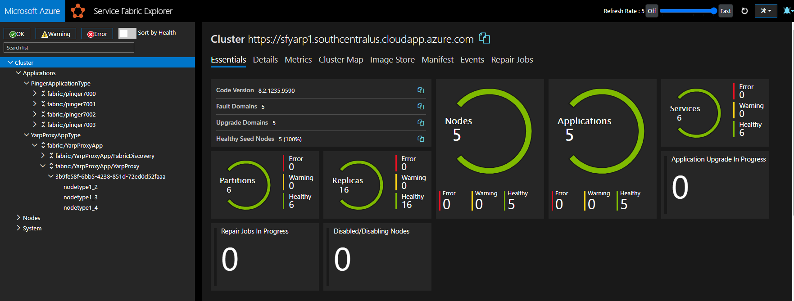
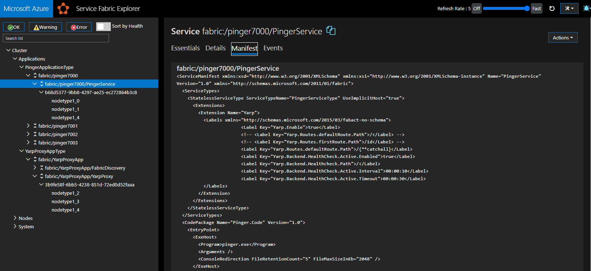
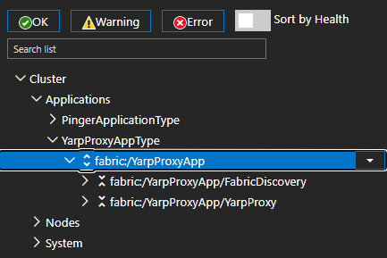

# ServiceFabricYarp (SFYarp) — reverse proxy for Service Fabric

**SFYarp** is a HTTP/HTTPS reverse proxy for Service
Fabric, built on [Microsoft YARP](https://github.com/dotnet/yarp). It
watches your cluster for services that opt in via
`ServiceManifest.xml` labels and forwards inbound traffic to them,
with SNI-based TLS, active health probes, header transforms, and the
rest of YARP's routing surface.

SFYarp runs on **Service Fabric managed clusters (SFMC)** and on
classic **Service Fabric Resource Provider (SFRP)** clusters. On SFMC
it is the recommended reverse-proxy option. The SF built-in reverse
proxy is not available on managed clusters.

> **Latest release.** SFYarp ships as a signed `.sfpkg` on the
> [Releases page](https://github.com/microsoft/service-fabric-yarp/releases/latest).
> Grab the latest ZIP or SFPKG there, then follow
> [§Quickstart on Service Fabric managed cluster (SFMC)](#quickstart-on-service-fabric-managed-cluster-sfmc).

Migrating off the built-in SF reverse proxy? Skip to
[§Migrating from the built-in reverse proxy](#migrating-from-the-built-in-reverse-proxy)
for the pointer to the full playbook.

---

## Table of Contents

1. [Background](#background)
2. [When to use SFYarp](#when-to-use-sfyarp)
3. [Migrating from the built-in reverse proxy](#migrating-from-the-built-in-reverse-proxy)
4. [Compatibility and limitations](#compatibility-and-limitations)
5. [How it works](#how-it-works)
6. [Quickstart on Service Fabric managed cluster (SFMC)](#quickstart-on-service-fabric-managed-cluster-sfmc)
7. [Deploying SFYarp](#deploying-sfyarp)
    - [Deploying via ARM (recommended for production)](#deploying-via-arm-recommended-for-production)
    - [Deploying via PowerShell (dev/test only)](#deploying-via-powershell-devtest-only)
8. [Configuring services with labels](#configuring-services-with-labels)
    - [Supported labels](#supported-labels)
9. [URI format for addressing services](#uri-format-for-addressing-services)
10. [Placement, sizing, and resource governance](#placement-sizing-and-resource-governance)
11. [TLS and certificates](#tls-and-certificates)
    - [SNI certificate selection](#sni-certificate-selection)
    - [Certificate naming (SAN/CN)](#certificate-naming-sancn)
    - [Deploying certificates to nodes](#deploying-certificates-to-nodes)
    - [Private key ACLs (`<EndpointCertificate>` declaration)](#private-key-acls-endpointcertificate-declaration)
    - [Extension ordering race on SFMC scale-out](#extension-ordering-race-on-sfmc-scale-out)
    - [In-cluster service-to-service traffic](#in-cluster-service-to-service-traffic)
    - [Certificate rotation](#certificate-rotation)
    - [SFYarp-to-backend TLS](#sfyarp-to-backend-tls)
12. [L7 gateway integration](#l7-gateway-integration)
13. [Network lockdown (NSG and Service Tags)](#network-lockdown-nsg-and-service-tags)
14. [Replica endpoint selection](#replica-endpoint-selection)
15. [Fabric Discovery service configuration](#fabric-discovery-service-configuration)
16. [Metadata](#metadata)
17. [Sample test application](#sample-test-application)
18. [Internal telemetry](#internal-telemetry)
19. [Tracing and logs](#tracing-and-logs)
    - [Collecting SFYarp logs](#collecting-sfyarp-logs)
20. [Troubleshooting](#troubleshooting)
21. [Development](#development)
22. [Contributing](#contributing)
23. [Trademarks](#trademarks)

---

## Background

Service Fabric's built-in HTTP reverse-proxy component (the reverse
proxy that ships with the SF runtime, typically listening on port
19081) hands off HTTP/HTTPS traffic to backend SF services after
resolving service endpoints via the SF Naming Service. It is
convenient but limited: no rule-based routing, no active health
probes, no per-service TLS, and no support on SFMC.

SFYarp addresses those gaps. It runs as an ordinary Service Fabric
application on the ingress node type and forwards traffic to backend
services using YARP. Backend services opt in to SFYarp by
declaring `Yarp.Enable=true` (plus any additional `Yarp.*` labels for
routing, health checks, transforms, or load balancing) in their
`ServiceManifest.xml` service-type extensions.

Two ASP.NET Core services make up SFYarp:

- **`YarpProxy.Service`** — the proxy itself. Terminates client
  connections on Kestrel, applies routing/transform rules, and
  forwards to backends. Listens on both HTTP and HTTPS ports by
  default.
- **`FabricDiscovery.Service`** — the Service Fabric integration
  layer. Watches the cluster for applications, services, endpoints,
  and SFYarp labels, and publishes the derived routing configuration
  to `YarpProxy.Service` in real time.

The two services are deployed together in a single SF application
package (`fabric:/YarpProxyApp`), one instance per node of the
ingress node type (`InstanceCount = -1`).

## When to use SFYarp

SFYarp is the right choice if any of these apply:

- **You are deploying to a Service Fabric managed cluster (SFMC).**
  The built-in reverse proxy is not available on SFMC. SFYarp is the
  recommended reverse-proxy option.
- **You want richer ingress capabilities than the built-in reverse
  proxy provides.** SFYarp gives you rule-based routing,
  configurable active health probes,
  SNI-based TLS with per-service certificates, header transforms,
  session affinity, and load-balancing policies from YARP.
- **You are consolidating multiple ingress systems.** SFYarp handles
  HTTP/HTTPS ingress for every labeled service in the cluster from a
  single application deployment.

## Migrating from the built-in reverse proxy

Moving off the SF built-in reverse proxy (the HTTP reverse-proxy
component on port 19081) onto SFYarp is a distinct workflow with its
own coexistence-and-cutover concerns. See the dedicated playbook:
[**Migrating from the Service Fabric Reverse Proxy to SFYarp**](docs/migrate-from-sf-reverse-proxy-to-sfyarp.md).

That guide covers the recommended coexistence-then-cutover path.
This README is the canonical reference for product-level topics. The
migration guide points at this README for depth and only covers
migration-specific concerns.

## Compatibility and limitations

**Service Fabric compatibility.**

- Service Fabric runtime version **11.5** or later — both SFMC and
  SFRP.
- Runs on the ingress node type. Does not need to run on the primary
  or system node type.

**Platform.**

- **Windows-only.** No Linux support.
- **HTTP / HTTPS only.** No TCP proxying.

**Behavior notes.**

- **Services are exposed only if labeled.** SFYarp does not
  auto-expose every service in the cluster. A service without
  `Yarp.Enable=true` returns 404 through SFYarp. This is intentional:
  the SF built-in reverse proxy auto-exposed every reachable
  service, which is not the safe default for a public ingress point.
- **Partition addressing uses `?PartitionID=<guid>`.** SFYarp does
  not translate `?PartitionKey=` and `?PartitionKind=` query params
  like the built-in reverse proxy did. Clients resolve the partition
  GUID once via SF Naming and pass it directly. See
  [§URI format for addressing services](#uri-format-for-addressing-services).
- **One endpoint per replica.** For a service replica that publishes
  multiple named endpoints, only one is selected, controlled by
  the `Yarp.Backend.ServiceFabric.ListenerName` label. See
  [§Replica endpoint selection](#replica-endpoint-selection).

## How it works

SFYarp sits between an L7 gateway and your Service Fabric services:

```text
Client  --HTTPS-->  L7 gateway  --HTTPS-->  SFYarp  --HTTP or HTTPS-->  SF service
```

At a high level:

1. `FabricDiscovery.Service` subscribes to Service Fabric Naming and
   observes every application, service, partition, and replica in
   the cluster. It reads the `Yarp` extension labels on each service
   type, builds a YARP route/cluster configuration, and publishes it
   to `YarpProxy.Service` over a local channel. Changes propagate in
   near real time. As services scale, move, or update labels,
   SFYarp's routing table updates without a proxy restart.
2. `YarpProxy.Service` listens on the configured HTTP and HTTPS
   ports (defaults `8080` and `443`), terminates TLS on the HTTPS
   port via Kestrel with SNI-based certificate selection, matches
   the request against the routing table, and forwards to a healthy
   replica of the selected backend service.

Backend services are addressed by their SF service name. The
inbound URL path starts with `/<AppName>/<ServiceName>/`. See
[§URI format for addressing services](#uri-format-for-addressing-services).

SFYarp deploys one instance of each service per node of the ingress
node type (`InstanceCount = -1`). It is a per-cluster ingress
component, not a per-application component. The same SFYarp
application fronts every labeled service in the cluster.

Below is what the deployed SFYarp application looks like in Service
Fabric Explorer once it is running:





## Quickstart on Service Fabric managed cluster (SFMC)

The fastest way to try SFYarp on a fresh SFMC is:

1. Grab the latest signed SFPKG from the
   [Releases page](https://github.com/microsoft/service-fabric-yarp/releases/latest).
2. Upload it to a versioned blob path in your storage account (see
   [§Deploying via ARM (recommended for production)](#deploying-via-arm-recommended-for-production)
   for the rationale on versioned paths).
3. Use the starter ARM template under
   [`docs/samples/sfmc-arm/`](docs/samples/sfmc-arm/) as the shape
   for the SFMC + SFYarp deployment. It provisions:
   - a Service Fabric managed cluster
   - a node type for the ingress workload
   - the SFYarp application type + version + application resources
4. Fill in your subscription, resource group, and certificate
   parameters, deploy, and validate against the sample pinger app in
   [§Sample test application](#sample-test-application).

You should end up with SFYarp running one instance per node on the
ingress node type, `LocalMachine\My` on those nodes carrying your
TLS certificate, and a healthy `fabric:/YarpProxyApp` application in
Service Fabric Explorer. See
[§Deploying SFYarp](#deploying-sfyarp) for the full ARM walkthrough
and the per-property rationale.

**Next steps.**

- Label your first backend service. See
  [§Configuring services with labels](#configuring-services-with-labels).
- Fit SFYarp behind your L7 gateway. See
  [§L7 gateway integration](#l7-gateway-integration).
- Lock down the ingress port. See
  [§Network lockdown (NSG and Service Tags)](#network-lockdown-nsg-and-service-tags).

## Deploying SFYarp

SFYarp deploys as a normal Service Fabric application. The supported
production path is ARM. PowerShell is fine for dev/test iteration on
an already-running cluster but should not be used for production
rollouts because it bypasses the ARM inventory that owns the rest of
your infrastructure.

### Deploying via ARM (recommended for production)

The ARM path publishes SFYarp as three resources under the managed
cluster:

- `Microsoft.ServiceFabric/managedclusters/applicationTypes` — one
  per application type name (`YarpProxyAppType`). Created once and
  reused across versions.
- `Microsoft.ServiceFabric/managedclusters/applicationTypes/versions`
  — one per SFYarp version you have deployed. `appPackageUrl` points
  at a versioned blob URL.
- `Microsoft.ServiceFabric/managedclusters/applications` — the
  running application instance (`fabric:/YarpProxyApp`). Its
  `version` property points at one specific
  `applicationTypes/versions` resource ID.

**1. Stage the SFPKG in blob storage.**

Fetch the SFPKG (`.sfpkg` is a `.zip` renamed) for the SFYarp version
you want from the
[Releases page](https://github.com/microsoft/service-fabric-yarp/releases).
Upload it to a **version-in-path** blob URL — for example:

```
https://<storage>.blob.core.windows.net/sfyarp/2.1.0/YarpProxyApp.sfpkg
```

Do **not** overwrite a previous version in-place. SFMC rejects
`appPackageUrl` changes on an already-active
`applicationTypes/versions` resource, so keeping every version at a
distinct path is what makes rollback possible.

If you need to edit `ApplicationManifest.xml` first — to add an
`<EndpointCertificate>` for HTTPS, apply
`<ServicePackageResourceGovernancePolicy>` CPU/memory limits, add
`<Parameters>` you plan to override from ARM, or apply
`<ConfigOverride>` blocks — unpack the SFPKG, edit
`YarpProxyApp/ApplicationManifest.xml`, and re-zip with the `.sfpkg`
extension before uploading.

**2. Add the SFYarp application resources to your SFMC template.**

Under the `Microsoft.ServiceFabric/managedclusters` resource, merge
the three application resources. The shape below is the minimum
production configuration — a full working example is under
[`docs/samples/sfmc-arm/`](docs/samples/sfmc-arm/):

```json
{
  "type":       "Microsoft.ServiceFabric/managedclusters/applicationTypes",
  "apiVersion": "2024-04-01",
  "name":       "[concat(parameters('clusterName'), '/YarpProxyAppType')]",
  "location":   "[parameters('location')]",
  "dependsOn":  [ "[resourceId('Microsoft.ServiceFabric/managedclusters', parameters('clusterName'))]" ]
},
{
  "type":       "Microsoft.ServiceFabric/managedclusters/applicationTypes/versions",
  "apiVersion": "2024-04-01",
  "name":       "[concat(parameters('clusterName'), '/YarpProxyAppType/', parameters('yarpAppTypeVersion'))]",
  "location":   "[parameters('location')]",
  "dependsOn":  [ "[resourceId('Microsoft.ServiceFabric/managedclusters/applicationTypes', parameters('clusterName'), 'YarpProxyAppType')]" ],
  "properties": {
    "appPackageUrl": "[parameters('yarpSfpkgUrl')]"
  }
},
{
  "type":       "Microsoft.ServiceFabric/managedclusters/applications",
  "apiVersion": "2024-04-01",
  "name":       "[concat(parameters('clusterName'), '/YarpProxyApp')]",
  "location":   "[parameters('location')]",
  "dependsOn":  [ "[resourceId('Microsoft.ServiceFabric/managedclusters/applicationTypes/versions', parameters('clusterName'), 'YarpProxyAppType', parameters('yarpAppTypeVersion'))]" ],
  "properties": {
    "version": "[resourceId('Microsoft.ServiceFabric/managedclusters/applicationTypes/versions', parameters('clusterName'), 'YarpProxyAppType', parameters('yarpAppTypeVersion'))]",
    "parameters": {
      "YarpProxy_InstanceCount":        "-1",
      "YarpProxy_PlacementConstraints": "NodeType==FrontEnd",
      "YarpProxy_HttpPort":             "8080",
      "YarpProxy_HttpsPort":            "443",
      "FabricDiscovery_InstanceCount":  "-1",
      "YarpProxyEnableTelemetry":       "true"
    }
  }
}
```

Notes:

- The application name **must** be `YarpProxyApp` — SFYarp discovers
  `FabricDiscovery.Service` via the `fabric:/YarpProxyApp` URI. A
  different name will cause `YarpProxy.Service` to crash-loop
  shortly after activation. See
  [§Troubleshooting](#troubleshooting).
- `InstanceCount = -1` on both services runs one instance per
  eligible node, the recommended configuration for ingress.
- `YarpProxy_PlacementConstraints` restricts SFYarp to the ingress
  node type. `FabricDiscovery.Service` reuses the same constraint
  automatically. No separate parameter is exposed. See
  [§Placement, sizing, and resource governance](#placement-sizing-and-resource-governance).
- For HTTPS, add an `<EndpointCertificate>` in
  `ApplicationManifest.xml` before staging the SFPKG (see
  [§Private key ACLs (`<EndpointCertificate>` declaration)](#private-key-acls-endpointcertificate-declaration))
  and provision the certificate to the ingress node type (see
  [§Deploying certificates to nodes](#deploying-certificates-to-nodes)).

**3. Upgrade to a new SFYarp version.**

Publish the new version by uploading its SFPKG to a **new**
version-in-path blob URL, then:

1. Add a new `applicationTypes/versions` resource pointing at the
   new blob.
2. Flip the `applications` resource's `version` property from the
   old resource ID to the new one.

SFMC performs a monitored rolling upgrade honoring the cluster's
`upgradePolicy` — see
[Service Fabric application upgrade](https://learn.microsoft.com/azure/service-fabric/service-fabric-application-upgrade)
and
[Application upgrade parameters](https://learn.microsoft.com/azure/service-fabric/service-fabric-application-upgrade-parameters)
for the full parameter surface.

Rollback is the same `version` flip in reverse, which is why
version-in-path storage matters. Keep the previous SFPKG and its
`applicationTypes/versions` resource around for at least one
rollback window.

### Deploying via PowerShell (dev/test only)

For iteration on an already-running cluster you can publish SFYarp
from PowerShell instead of ARM. Do **not** use this path for
production rollouts.

```powershell
# Connect to your cluster (adjust for your auth model)
Connect-ServiceFabricCluster `
    -ConnectionEndpoint '<cluster-fqdn>:19000' `
    -X509Credential `
    -FindType FindByThumbprint -FindValue '<client-cert-thumbprint>' `
    -StoreLocation LocalMachine -StoreName 'My'

# Optionally remove a previous deployment
# Remove-ServiceFabricApplication -ApplicationName fabric:/YarpProxyApp -Force
# Unregister-ServiceFabricApplicationType -ApplicationTypeName YarpProxyAppType -ApplicationTypeVersion <version> -Force

$pkg = "C:\downloads\service-fabric-yarp\windows\YarpProxyApp"

Copy-ServiceFabricApplicationPackage `
    -ApplicationPackagePath $pkg `
    -ApplicationPackagePathInImageStore YarpProxyApp `
    -CompressPackage `
    -TimeoutSec 1800
Register-ServiceFabricApplicationType `
    -ApplicationPathInImageStore YarpProxyApp

New-ServiceFabricApplication `
    -ApplicationName fabric:/YarpProxyApp `
    -ApplicationTypeName YarpProxyAppType `
    -ApplicationTypeVersion '<version>' `
    -ApplicationParameter @{
        YarpProxy_InstanceCount        = "-1"
        YarpProxy_PlacementConstraints = "NodeType==FrontEnd"
        YarpProxy_HttpPort             = "8080"
        YarpProxy_HttpsPort            = "443"
        FabricDiscovery_InstanceCount  = "-1"
        YarpProxyEnableTelemetry       = "true"
    }
```

Verify the deployment landed:

```powershell
Get-ServiceFabricApplication -ApplicationName fabric:/YarpProxyApp |
  Get-ServiceFabricService | Get-ServiceFabricPartition |
  Get-ServiceFabricReplica |
  Format-Table NodeName, ReplicaOrInstanceStatus
```

Upgrade an in-place deployment with a monitored rollout:

```powershell
Start-ServiceFabricApplicationUpgrade `
    -ApplicationName fabric:/YarpProxyApp `
    -ApplicationTypeVersion '<new-version>' `
    -ApplicationParameter $p `
    -Monitored -FailureAction Rollback
```

## Configuring services with labels

Backend services opt in to SFYarp by declaring an `<Extension>` named
`Yarp` under their service-type in `ServiceManifest.xml`. Labels
inside that extension configure route matching, backend behavior,
health checks, and SF-integration hints.

A minimal opt-in:

```xml
<StatelessServiceType ServiceTypeName="PingerServiceType" UseImplicitHost="true">
  <Extensions>
    <Extension Name="Yarp">
      <Labels xmlns="http://schemas.microsoft.com/2015/03/fabact-no-schema">
        <Label Key="Yarp.Enable">true</Label>
        <Label Key="Yarp.Routes.defaultRoute.Path">/{**catchall}</Label>
        <Label Key="Yarp.Backend.HealthCheck.Active.Enabled">true</Label>
        <Label Key="Yarp.Backend.HealthCheck.Active.Path">/</Label>
        <Label Key="Yarp.Backend.HealthCheck.Active.Interval">00:00:30</Label>
        <Label Key="Yarp.Backend.HealthCheck.Active.Timeout">00:00:05</Label>
      </Labels>
    </Extension>
  </Extensions>
</StatelessServiceType>
```

The only **required** label is `Yarp.Enable=true`. With just that
plus a `Yarp.Routes.<name>.Path`, SFYarp exposes the service at
`/<AppName>/<ServiceName>/<path>` on both the HTTP and HTTPS ports
and health-probes the backend with the defaults from YARP.

> **Containers.** Containerized SF services need no SFYarp-specific
> configuration. Opt them in with the same `ServiceManifest.xml`
> labels as any other service. SFYarp routes to whichever endpoint
> SF publishes in the Naming Service.

**Common recipes:**

- **Match by hostname:**
  ```xml
  <Label Key="Yarp.Routes.tenantA.Path">/{**catchall}</Label>
  <Label Key="Yarp.Routes.tenantA.Hosts">tenant-a.contoso.com</Label>
  ```
- **Match by method + header:**
  ```xml
  <Label Key="Yarp.Routes.writes.Path">/api/{**catchall}</Label>
  <Label Key="Yarp.Routes.writes.Methods">POST,PUT,DELETE</Label>
  <Label Key="Yarp.Routes.writes.MatchHeaders.[0].Name">x-tenant</Label>
  <Label Key="Yarp.Routes.writes.MatchHeaders.[0].Values">acme</Label>
  ```
- **HTTPS backend, TLS 1.2/1.3, HTTP/2:**
  ```xml
  <Label Key="Yarp.Backend.HttpRequest.Version">2</Label>
  <Label Key="Yarp.Backend.HttpClient.SslProtocols">Tls12,Tls13</Label>
  <Label Key="Yarp.Backend.HttpClient.DangerousAcceptAnyServerCertificate">false</Label>
  ```
- **Reject HTTP-only backends** (recommended for production):
  ```xml
  <Label Key="Yarp.Backend.AllowInsecureHttp">false</Label>
  ```
  The default is currently `true`. SFYarp will forward to a
  plain-HTTP backend unless this label sets the route to `false`.
- **Stateful primary-only:**
  ```xml
  <Label Key="Yarp.Backend.ServiceFabric.StatefulReplicaSelectionMode">PrimaryOnly</Label>
  ```
- **Alternate listener** (when the service exposes multiple named
  endpoints):
  ```xml
  <Label Key="Yarp.Backend.ServiceFabric.ListenerName">MyAltListener</Label>
  ```
- **Preserve the original `Host` header** to the backend (needed for
  backend SNI validation — see
  [§In-cluster service-to-service traffic](#in-cluster-service-to-service-traffic)):
  ```xml
  <Label Key="Yarp.Routes.defaultRoute.Transforms.[0].RequestHeaderOriginalHost">true</Label>
  ```

> **App-parameter substitution.** Label values can reference an
> `ApplicationManifest.xml` parameter with the special syntax
> `[AppParamName]` — the same convention as elsewhere in Service
> Fabric. Enable per service with
> `Yarp.EnableDynamicOverrides=true`. See
> [Using parameters in Service Fabric](https://learn.microsoft.com/azure/service-fabric/service-fabric-how-to-specify-port-number-using-parameters).

### Supported labels

Three families of labels: **Route** (per-route matching and
transforms), **Backend/Cluster** (per-service load balancing, HTTP
client, active/passive health checks), and **Service Fabric
integration** (SF-specific hints).

**Service Fabric integration.**

- `Yarp.Enable` — opt the service in to SFYarp. Set to `true`.
  Default `false`.
- `Yarp.EnableDynamicOverrides` — enable `[AppParamName]`
  substitution inside label values. Default `false`.

**Route section** — `Yarp.Routes.<routeName>.<property>`. Route
names contain ASCII letter, digit, `_`, or `-`. Indexing pattern
`[<Index>]` is 0-based integer.

- `.Path` — path-based matching. Assigned to
  [`RouteMatch.Path`](https://github.com/microsoft/reverse-proxy/blob/bd11867bee7df522e7fd3effb08a9c85fd616908/src/ReverseProxy/Configuration/RouteMatch.cs#L29).
  Use `/{**catchall}` to match everything.
- `.Hosts` — comma-separated list of hostnames. Assigned to
  [`RouteMatch.Hosts`](https://github.com/microsoft/reverse-proxy/blob/bd11867bee7df522e7fd3effb08a9c85fd616908/src/ReverseProxy/Configuration/RouteMatch.cs#L24).
- `.Methods` — comma-separated HTTP methods (e.g. `GET,POST`).
  Assigned to
  [`RouteMatch.Methods`](https://github.com/microsoft/reverse-proxy/blob/bd11867bee7df522e7fd3effb08a9c85fd616908/src/ReverseProxy/Configuration/RouteMatch.cs#L18).
- `.MatchHeaders.[<Index>].*` — header-based matching. Each index
  builds a
  [`RouteHeader`](https://github.com/microsoft/reverse-proxy/blob/bd11867bee7df522e7fd3effb08a9c85fd616908/src/ReverseProxy/Configuration/RouteHeader.cs#L13).
  The list is assigned to
  [`RouteMatch.Headers`](https://github.com/microsoft/reverse-proxy/blob/bd11867bee7df522e7fd3effb08a9c85fd616908/src/ReverseProxy/Configuration/RouteMatch.cs#L39).
- `.MatchQueries.[<Index>].*` — query-parameter matching. Each
  index builds a
  [`RouteQueryParameter`](https://github.com/microsoft/reverse-proxy/blob/bd11867bee7df522e7fd3effb08a9c85fd616908/src/ReverseProxy/Configuration/RouteQueryParameter.cs#L13).
  The list is assigned to
  [`RouteMatch.QueryParameters`](https://github.com/microsoft/reverse-proxy/blob/bd11867bee7df522e7fd3effb08a9c85fd616908/src/ReverseProxy/Configuration/RouteMatch.cs#L34).
- `.Order` — explicit precedence. Lower numbers take precedence.
  Assigned to
  [`RouteConfig.Order`](https://github.com/microsoft/reverse-proxy/blob/bd11867bee7df522e7fd3effb08a9c85fd616908/src/ReverseProxy/Configuration/RouteConfig.cs#L33).
- `.Transforms.[<Index>].*` — request/response transforms. Each
  index becomes a
  [Transform](https://microsoft.github.io/reverse-proxy/articles/transforms.html)
  dictionary. The list is assigned to
  [`RouteConfig.Transforms`](https://github.com/microsoft/reverse-proxy/blob/bd11867bee7df522e7fd3effb08a9c85fd616908/src/ReverseProxy/Configuration/RouteConfig.cs#L103).
- `.AuthorizationPolicy` — name of an ASP.NET Core authorization
  policy. Assigned to
  [`RouteConfig.AuthorizationPolicy`](https://github.com/microsoft/reverse-proxy/blob/bd11867bee7df522e7fd3effb08a9c85fd616908/src/ReverseProxy/Configuration/RouteConfig.cs#L47).
- `.CorsPolicy` — name of a CORS policy. Assigned to
  [`RouteConfig.CorsPolicy`](https://github.com/microsoft/reverse-proxy/blob/bd11867bee7df522e7fd3effb08a9c85fd616908/src/ReverseProxy/Configuration/RouteConfig.cs#L85).
- `.Metadata` — arbitrary key/value pairs. Assigned to
  [`RouteConfig.Metadata`](https://github.com/microsoft/reverse-proxy/blob/bd11867bee7df522e7fd3effb08a9c85fd616908/src/ReverseProxy/Configuration/RouteConfig.cs#L98).

Each route requires either a `.Path` or a `.Hosts` (or both). If
both are set, the request must match both. Match precedence follows
YARP's
[header-routing precedence rules](https://microsoft.github.io/reverse-proxy/articles/header-routing.html#precedence),
overridable via `.Order`.

Route example:

```xml
<Label Key="Yarp.Routes.route-A1.Path">/api</Label>
<Label Key="Yarp.Routes.route-B2.Path">/control-api</Label>
<Label Key="Yarp.Routes.route-B2.Hosts">example.com,anotherexample.com</Label>
<Label Key="Yarp.Routes.ExampleRoute.Path">/exampleroute</Label>
<Label Key="Yarp.Routes.ExampleRoute.Metadata.Foo">Bar</Label>
<Label Key="Yarp.Routes.ExampleRoute.Methods">GET,PUT</Label>
<Label Key="Yarp.Routes.ExampleRoute.Order">2</Label>
<Label Key="Yarp.Routes.ExampleRoute.MatchQueries.[0].Mode">Exact</Label>
<Label Key="Yarp.Routes.ExampleRoute.MatchQueries.[0].Name">orgID</Label>
<Label Key="Yarp.Routes.ExampleRoute.MatchQueries.[0].Values">123456789</Label>
<Label Key="Yarp.Routes.ExampleRoute.MatchQueries.[0].IsCaseSensitive">true</Label>
<Label Key="Yarp.Routes.ExampleRoute.MatchHeaders.[0].Mode">ExactHeader</Label>
<Label Key="Yarp.Routes.ExampleRoute.MatchHeaders.[0].Name">x-company-key</Label>
<Label Key="Yarp.Routes.ExampleRoute.MatchHeaders.[0].Values">contoso</Label>
<Label Key="Yarp.Routes.ExampleRoute.MatchHeaders.[0].IsCaseSensitive">true</Label>
<Label Key="Yarp.Routes.ExampleRoute.Transforms.[0].ResponseHeader">X-Foo</Label>
<Label Key="Yarp.Routes.ExampleRoute.Transforms.[0].Append">Bar</Label>
<Label Key="Yarp.Routes.ExampleRoute.Transforms.[0].When">Always</Label>
<Label Key="Yarp.Routes.ExampleRoute.Transforms.[1].ResponseHeader">X-Ping</Label>
<Label Key="Yarp.Routes.ExampleRoute.Transforms.[1].Append">Pong</Label>
<Label Key="Yarp.Routes.ExampleRoute.Transforms.[1].When">Success</Label>
<Label Key="Yarp.Routes.ExampleRoute.AuthorizationPolicy">Policy1</Label>
<Label Key="Yarp.Routes.ExampleRoute.CorsPolicy">Policy1</Label>
```

**Backend/Cluster section** — `Yarp.Backend.<property>`. Applies to
the SFYarp cluster (one YARP cluster per SF service).

- `Yarp.Backend.BackendId` — override the cluster ID. Default is
  the SF service name.
- `Yarp.Backend.LoadBalancingPolicy` — YARP load-balancing policy.
  See
  [YARP load balancing](https://microsoft.github.io/reverse-proxy/articles/load-balancing.html).
- `Yarp.Backend.SessionAffinity.*` — YARP session affinity
  settings. See
  [YARP session affinity](https://microsoft.github.io/reverse-proxy/articles/session-affinity.html).
- `Yarp.Backend.HttpRequest.*` — proxied HTTP request properties
  (`Version`, `VersionPolicy`, `ActivityTimeout`, etc.). See
  [YARP `HttpRequest`](https://microsoft.github.io/reverse-proxy/articles/http-client-config.html#httprequest).
- `Yarp.Backend.HttpClient.*` — HTTP client properties
  (`SslProtocols`, `DangerousAcceptAnyServerCertificate`,
  `MaxConnectionsPerServer`, etc.). See
  [YARP `HttpClient`](https://microsoft.github.io/reverse-proxy/articles/http-client-config.html#httpclient).
- `Yarp.Backend.HealthCheck.Active.*` — active health checks
  (`Enabled`, `Path`, `Interval`, `Timeout`, `Policy`). See
  [YARP active health checks](https://microsoft.github.io/reverse-proxy/articles/dests-health-checks.html#active-health-checks).
- `Yarp.Backend.HealthCheck.Passive.*` — passive health checks.
  See
  [YARP passive health checks](https://microsoft.github.io/reverse-proxy/articles/dests-health-checks.html#passive-health-checks).
- `Yarp.Backend.Metadata.*` — arbitrary cluster metadata.
- `Yarp.Backend.AllowInsecureHttp` — allow forwarding to plain-HTTP
  backend endpoints. Default `true`. Set to `false` on every
  production route.

**Service Fabric integration hints** — `Yarp.Backend.ServiceFabric.*`
and `Yarp.Backend.HealthCheck.Active.ServiceFabric.*`. Not part of
YARP core; SFYarp uses them to pick a specific replica listener and
select stateful replicas.

- `Yarp.Backend.ServiceFabric.ListenerName` — pick a named endpoint
  when the service publishes multiple. Stored on
  `Destination.Address` in YARP's model.
- `Yarp.Backend.HealthCheck.Active.ServiceFabric.ListenerName` —
  pick a named endpoint for the active health-probe target. Stored
  on `Destination.Health` in YARP's model.
- `Yarp.Backend.ServiceFabric.StatefulReplicaSelectionMode` —
  `PrimaryOnly`, `SecondaryOnly`, or `All`. Default `PrimaryOnly`.
  `SecondaryOnly` and `All` also route to active secondaries.

## URI format for addressing services

The SFYarp inbound URL identifies the service to forward to via its
service name in the path:

```
http(s)://<Cluster FQDN | internal IP>:<port>/<AppName>/<ServiceName>/<Suffix>?PartitionID=<PartitionGUID>
```

- **`http(s):`** — SFYarp listens on both HTTP and HTTPS by default
  (defaults `8080` and `443`). See
  [§TLS and certificates](#tls-and-certificates) for HTTPS.
- **`<Cluster FQDN | internal IP>:<port>`** — public FQDN when
  fronted by a public load balancer, internal IP or `localhost` for
  in-cluster callers.
- **`<AppName>/<ServiceName>`** — the SF service name without the
  `fabric:/` scheme. For `fabric:/myapp/myservice`, use
  `myapp/myservice`.
- **`<Suffix>`** — the path the backend receives, e.g.
  `values/add/3`.
- **`?PartitionID=<PartitionGUID>`** — required when addressing a
  specific partition of a **multi-partition** stateful service.
  Retrieve the GUID via `Get-ServiceFabricPartition` or from
  Service Fabric Explorer (SFX). Do **not** pass `PartitionID` for
  single-partition services — it is ignored.

## Placement, sizing, and resource governance

**Recommended defaults.**

- Do **not** run SFYarp on the primary/system node type. Reserve it
  for the ingress node type — same fault domain, upgrade domain, and
  load-balancer backend pool as your other ingress-facing services.
- Use `InstanceCount = -1` on both `YarpProxy.Service` and
  `FabricDiscovery.Service`. This tells Service Fabric to place one
  instance per eligible node so SFYarp scales in and out with the
  ingress node type automatically.
- Constrain placement with `YarpProxy_PlacementConstraints`. Example:
  ```text
  YarpProxy_PlacementConstraints = "NodeType==FrontEnd"
  ```
  On SFMC the constraint uses whatever node-type name your managed
  cluster resource exposes. `FabricDiscovery.Service` reuses the
  same constraint from the shipped manifest — no separate parameter
  is exposed.

The SFYarp application manifest sets `DefaultMoveCost="High"` on
`YarpProxyType` so the Service Fabric Cluster Resource Manager
avoids moving the proxy during normal load balancing.

**Resource governance (CPU/memory limits).** The SFYarp package does
**not** ship a
[`<ServicePackageResourceGovernance>`](https://learn.microsoft.com/azure/service-fabric/service-fabric-resource-governance)
policy by default. Conservative starting values for the ingress
node type:

| Package | CpuCores | MemoryInMB |
|---|---|---|
| `YarpProxy.Service` | 1 | 1024 |
| `FabricDiscovery.Service` | 0.5 | 512 |

Baseline against representative traffic on your target VM SKU and
tighten once you have steady-state working-set and CPU numbers.
Apply the limit in `ApplicationManifest.xml`:

```xml
<ServiceManifestImport>
  <ServiceManifestRef ServiceManifestName="YarpProxy.ServicePkg" ServiceManifestVersion="..."/>
  <Policies>
    <ServicePackageResourceGovernancePolicy CpuCores="1" MemoryInMB="1024"/>
  </Policies>
</ServiceManifestImport>
```

## TLS and certificates

TLS setup is the single largest source of first-day incidents. Read
this section end-to-end before provisioning.

**HTTPS-first defaults.** In production:

- Terminate TLS on port `443` (or a chosen HTTPS port) — expose the
  HTTP port only to internal callers, if at all.
- Reject HTTP-only backend endpoints per route with
  `Yarp.Backend.AllowInsecureHttp=false` (see
  [§Configuring services with labels](#configuring-services-with-labels)).
- Require modern TLS on backend calls with
  `Yarp.Backend.HttpClient.SslProtocols=Tls12,Tls13` where backends
  can support it.

### SNI certificate selection

Kestrel binds with **SNI** — Server Name Indication (SNI)
extension selects the matching certificate by
SAN. This happens **before** any HTTP request is parsed, so the
HTTP `Host` header does not drive certificate selection. TLS **1.2
and 1.3** are on by default.

`YarpProxy.Service` enumerates certificates in `LocalMachine\My` at
startup and keeps the ones that:

- are currently valid
- have a private key
- chain-validate
- carry the Server Authentication EKU

### Certificate naming (SAN/CN)

The certificate must have a **SAN** (or CN, for legacy clients)
matching the hostname callers use:

- If callers use a DNS name like `https://api.contoso.com`, the
  certificate must have `api.contoso.com` in its SAN.
- If callers use the cluster FQDN
  `https://<cluster-fqdn>.<location>.cloudapp.azure.com`, the SAN
  must cover the cluster FQDN.
- SFMC ships a default cluster certificate whose subject does
  **not** match your DNS name. **Don't rely on it for SFYarp.**
  Provision your own certificate.
- Certificates from a public CA, your organization's private CA, or
  Azure Key Vault-generated certs all work. Public callers need a
  publicly-trusted issuer. In-cluster callers can accept a private
  CA.

> **If your certificate is not from a publicly-trusted CA.** SFYarp
> filters out any certificate from `LocalMachine\My` that fails
> chain validation (see
> [§SNI certificate selection](#sni-certificate-selection)), so any
> issuer the machine doesn't already trust must be present in
> `LocalMachine\Root`:
>
> - **Publicly-trusted CA** (DigiCert, Let's Encrypt, GlobalSign,
>   etc.): nothing extra — the roots ship with Windows.
> - **Private / internal CA:** deploy the CA's root certificate
>   (and any intermediates) to `LocalMachine\Root` on every ingress
>   node.
> - **Self-signed** (dev/test only): the leaf is its own root, so
>   the same certificate lands in both `LocalMachine\My` and
>   `LocalMachine\Root`.

### Deploying certificates to nodes

Store the certificate (with private key) in Azure Key Vault as a
**Certificate** (not a Secret) — a PFX-backed KV certificate is
required either way. From there, two supported paths land it in
`LocalMachine\My` on the ingress node type. Pick one based on your
rotation model.

**Option 1 (recommended default): Azure Key Vault VM extension.**

The Key Vault VM extension polls Key Vault on a configurable
interval and installs new certificate versions into
`LocalMachine\My` on the running node. Rotate certificates by
publishing a new version to Key Vault — no ARM update, no node-type
redeploy. This is the recommended default when your recovery
playbook is "issue a new certificate in KV" rather than "redeploy
infrastructure."

The cost is that the extension participates in **extension
ordering**. Three settings work together on `KVVMExtension` — two
for sequencing, one for completion — and each closes a different
race:

- `setupOrder: ["BeforeSFRuntime"]` — SFMC schedules the extension
  in the pre-runtime slot, so it must report success before the SF
  node extension starts. Requires SFMC API version
  `2023-09-01-preview` or later.
- `provisionAfterExtensions: ["SfmcSetupVmExt"]` — chain KV after
  the RP-injected base-setup extension, so certificate install
  doesn't race base setup.
- `requireInitialSync: true` — make the extension report success
  only after the first certificate fetch completes, so downstream
  ordering actually implies the certificate is on disk.

Use all three on SFMC. See
[§Extension ordering race on SFMC scale-out](#extension-ordering-race-on-sfmc-scale-out)
for the races these fields solve, and for the fallback path if
you're on an older SFMC API version (no `setupOrder`).

On classic SFRP you own the VMSS directly — put `KVVMExtension` on
the VMSS resource and use `provisionAfterExtensions` on the SF node
extension to chain it after KV.

> **Managed-identity prerequisites (Option 1 only).** `KVVMExtension`
> uses a managed identity attached to the SFYarp node type to fetch
> KV secrets at runtime. Before deploying the extension:
>
> - Attach a user-assigned or system-assigned identity to the SFYarp
>   node type and grant it read on the KV — `Key Vault Secrets User`
>   (RBAC), or `Get + List` on a legacy access policy.
> - For user-assigned identities on SFMC, grant the **Service Fabric
>   managed cluster resource provider** the `Managed Identity
>   Operator` role on the identity so it can attach the identity to
>   the underlying VMSS. Missing this grant fails deploy with
>   `LinkedAuthorizationFailed` (see
>   [§Troubleshooting](#troubleshooting)).
>
> Full RBAC and template shape:
> [Add a managed identity to a Service Fabric managed cluster node type](https://learn.microsoft.com/azure/service-fabric/how-to-managed-identity-managed-cluster-virtual-machine-scale-sets).

On SFMC, add `KVVMExtension` under the node-type `vmExtensions[]`:

```json
{
  "type": "Microsoft.ServiceFabric/managedclusters/nodetypes",
  "apiVersion": "2023-09-01-preview",
  "properties": {
    "vmExtensions": [
      {
        "name": "KVVMExtension",
        "properties": {
          "publisher":               "Microsoft.Azure.KeyVault",
          "type":                    "KeyVaultForWindows",
          "typeHandlerVersion":      "3.0",
          "autoUpgradeMinorVersion": true,
          "provisionAfterExtensions": [ "SfmcSetupVmExt" ],
          "setupOrder":              [ "BeforeSFRuntime" ],
          "settings": {
            "secretsManagementSettings": {
              "pollingIntervalInS":       "3600",
              "observedCertificates": [
                "https://<your-kv>.vault.azure.net/secrets/YarpProxySslCert"
              ],
              "certificateStoreName":     "My",
              "certificateStoreLocation": "LocalMachine",
              "linkOnRenewal":            true,
              "requireInitialSync":       true
            }
          }
        }
      }
    ]
  }
}
```

Together these three fields close the SFYarp-activation-vs-certificate
race on both boundaries. Keep **all three** on `KVVMExtension`
(all shown above) — each closes a different race:

- `provisionAfterExtensions: ["SfmcSetupVmExt"]` chains KV after the
  RP-injected base-setup extension, so certificate install doesn't
  race the VM coming online.
- `setupOrder: ["BeforeSFRuntime"]` schedules KV in the pre-runtime
  slot, so it must complete before the SF node extension starts and
  activates SFYarp. See
  [Provision extensions before Service Fabric runtime](https://learn.microsoft.com/azure/service-fabric/how-to-managed-cluster-vmss-extension#how-to-provision-before-service-fabric-runtime).
- `requireInitialSync: true` makes the extension report success only
  after the first certificate fetch completes — so "KV extension
  done" actually means "certificate is in `LocalMachine\My`."

Dropping any one leaves a window where SFYarp activation can race
either base setup or the initial certificate import — see
[§Extension ordering race on SFMC scale-out](#extension-ordering-race-on-sfmc-scale-out).

On classic SFRP, put `KVVMExtension` on the VMSS resource and use
`provisionAfterExtensions` on the SF node extension to chain it
after KV.

**Option 2: `vmSecrets` on the node type.**

`vmSecrets` uses Azure VMSS's native `osProfile.secrets` plumbing —
certificates are injected during VM provisioning, **before any VM
extension runs**. This sidesteps the extension-ordering race
entirely and does not depend on any SFMC API-version feature.

Rotation is done by updating the ARM template with a new versioned
certificate URL and re-deploying the node type.

**Choose Option 2 if any of these apply:**

- You can't set `setupOrder: ["BeforeSFRuntime"]` (SFMC API older
  than `2023-09-01-preview`. See
  [§Extension ordering race on SFMC scale-out](#extension-ordering-race-on-sfmc-scale-out)).
- You want certificate rotation to go through your ARM/CI pipeline
  — not a background poll from Key Vault.
- Your nodes can't reach Key Vault at runtime.
- You want certificates present before any VM extension runs,
  structurally.

On SFMC, add `vmSecrets` to the node-type resource:

```json
{
  "type": "Microsoft.ServiceFabric/managedclusters/nodetypes",
  "properties": {
    "vmSecrets": [
      {
        "sourceVault": { "id": "<KV resource ID>" },
        "vaultCertificates": [
          {
            "certificateUrl":   "https://<kv>.vault.azure.net/secrets/YarpProxySslCert/<version>",
            "certificateStore": "My"
          }
        ]
      }
    ]
  }
}
```

On classic SFRP, put the same `secrets` block on the VMSS resource
under `osProfile.windowsConfiguration.secrets`.

**KV VM extension configuration — SFYarp-specific bits.**

The KV VM extension has a generic configuration surface
(`typeHandlerVersion`, `pollingIntervalInS`, `linkOnRenewal`,
`requireInitialSync`, etc.) that is independent of SF. Pick those
per the
[Key Vault VM extension docs](https://learn.microsoft.com/azure/virtual-machines/extensions/key-vault-windows).
For SFYarp specifically:

- `certificateStoreLocation: LocalMachine` and
  `certificateStoreName: My` are required — SFYarp enumerates
  `LocalMachine\My` for SNI selection. Any other store is invisible
  to Kestrel.
- List every certificate SFYarp needs (SSL cert plus any cluster or
  application-secret certs) in `observedCertificates`.
- On SFMC, set both `provisionAfterExtensions: ["SfmcSetupVmExt"]`
  and `setupOrder: ["BeforeSFRuntime"]` on the KV extension itself
  as shown above. On classic SFRP, add `provisionAfterExtensions`
  on the SF node extension so it runs after the KV extension.

**Verify certificates on each node (either option).** After
deployment, run this on any ingress node to confirm the certificates
are present with the expected SAN:

```powershell
Get-ChildItem cert:\LocalMachine\My |
  Where-Object { $_.HasPrivateKey } |
  Select-Object Thumbprint, Subject,
    @{n='SAN';e={($_.Extensions |
      Where-Object { $_.Oid.FriendlyName -eq 'Subject Alternative Name' }).Format(1)}},
    NotAfter
```

### Private key ACLs (`<EndpointCertificate>` declaration)

Kestrel needs read access to the certificate's private key — and by
default Service Fabric applications run under **Network Service**,
which does not have private-key access to arbitrary certificates in
`LocalMachine\My`.

Declare the certificate in the SFYarp `ApplicationManifest.xml` as
an `<EndpointCertificate>`. When Service Fabric activates the
application, it ACLs the certificate's private key for the account
that hosts the endpoint.

The shipped `ApplicationManifest.xml` does **not** carry an
`<EndpointCertificate>` or the parameters that select the
certificate — you patch both in before you zip the SFPKG. Add these
two `<Parameter>` entries and a `<Certificates>` block whose
`X509FindValue` binds to whichever parameter you populate at deploy
time. The parameter names below (`EndpointCertSubject`,
`EndpointCertThumbprint`) match the ARM sample under
[`docs/samples/sfmc-arm/`](docs/samples/sfmc-arm/).

```xml
<Parameters>
  <!-- ...existing parameters... -->
  <Parameter Name="EndpointCertSubject"    DefaultValue="" />
  <Parameter Name="EndpointCertThumbprint" DefaultValue="" />
</Parameters>

<!-- Place this <Certificates> block at the end of ApplicationManifest.xml,
     after the last <ServiceManifestImport>. -->
<Certificates>
  <EndpointCertificate Name="YarpProxyCert"
                       X509FindType="FindBySubjectName"
                       X509FindValue="[EndpointCertSubject]"
                       X509StoreName="My"/>
</Certificates>
```

Populate one of the two parameters from ARM (or PowerShell) — leave
the other empty:

- `EndpointCertSubject` with `FindBySubjectName` — preferred, since
  it survives certificate rotation. Pass the **bare** subject value
  (e.g. `myyarpcluster.westus2.cloudapp.azure.com`) — do **not**
  include a `CN=` prefix.
- `EndpointCertThumbprint` with `FindByThumbprint` — use only when
  you version certs by thumbprint. Swap the `X509FindType` and
  `X509FindValue` in the `<EndpointCertificate>` block above to
  `FindByThumbprint` / `[EndpointCertThumbprint]` in that case.

SFYarp reads the ACL'd private key at runtime and serves it via SNI.

Manual `Set-Acl` against `%ProgramData%\Microsoft\Crypto\Keys` is a
last resort. It does not survive certificate rotation and it does
not gate SFYarp activation — always prefer the
`<EndpointCertificate>` declaration.

### Extension ordering race on SFMC scale-out

On SFMC, when the ingress node type scales out, Azure adds a fresh
VM to the underlying VMSS. Without ordering hints, the VM starts
its extensions with only implicit constraints — opening **two**
distinct races that both make SFYarp unreachable on the new node
until they resolve.

**Race 1: KV vs. `SfmcSetupVmExt`.** `SfmcSetupVmExt` is
the RP-injected base-setup extension. If `KVVMExtension` runs in
parallel, certificate install can land on a VM that isn't fully set
up yet, leaving the certificate store in an inconsistent state.
Fixed by `provisionAfterExtensions: ["SfmcSetupVmExt"]` on
`KVVMExtension`, which sequences KV after `SfmcSetupVmExt`
completes.

**Race 2: KV vs. SF runtime.** If the SF node extension
starts before `KVVMExtension` finishes its first certificate fetch,
SFYarp activation on the new node finds no matching certificate in
`LocalMachine\My` and the activation attempt fails. Service Fabric
keeps retrying activation, so the ingress port has no SFYarp listener
on that node until `KVVMExtension` catches up and a subsequent retry
succeeds. Fixed by `setupOrder: ["BeforeSFRuntime"]` on
`KVVMExtension`, combined with `requireInitialSync: true` — SFMC
waits for KV's initial certificate fetch before starting the SF
runtime, so the first activation attempt already sees the
certificate.

**Fixes, in order of preference:**

1. **Both `provisionAfterExtensions: ["SfmcSetupVmExt"]` and
   `setupOrder: ["BeforeSFRuntime"]` on `KVVMExtension`**, plus
   `requireInitialSync: true`. `setupOrder` requires SFMC API
   version `2023-09-01-preview` or later; `provisionAfterExtensions`
   works on any SFMC API version. This closes both races and is the
   supported long-term fix.
2. **`vmSecrets` (Option 2 above)** — sidesteps both races entirely
   because certs are injected pre-boot, before any VM extension
   runs. Choose this if you're stuck on an older SFMC API version
   (so you can't set `setupOrder`).
3. **Application-side retry** — a very short window can be
   tolerated with SFYarp's built-in activation retries plus healthy
   L7 probe handling (see
   [§L7 gateway integration](#l7-gateway-integration)). Not a
   substitute for the ordering fixes above; use as belt-and-braces.

### In-cluster service-to-service traffic

Two patterns for services that call each other **through** SFYarp
(rather than dialing SF Naming directly):

- **Preserve the client `Host` header.** Backends that validate
  incoming SNI/`Host` against their own certificate need to see the
  original hostname, not the cluster FQDN. Add the transform on the
  route:
  ```xml
  <Label Key="Yarp.Routes.defaultRoute.Transforms.[0].RequestHeaderOriginalHost">true</Label>
  ```
- **HTTPS backend with a private-CA cert.** Deploy the backend
  service's server-cert issuing CA root to `LocalMachine\Root` on
  the ingress node type (see
  [§Certificate naming (SAN/CN)](#certificate-naming-sancn)).
  Combine with
  `Yarp.Backend.HttpClient.SslProtocols=Tls12,Tls13`. Do **not** use
  `Yarp.Backend.HttpClient.DangerousAcceptAnyServerCertificate=true`
  in production.

For most in-cluster callers the simpler pattern — direct SF
Remoting or direct Naming Service resolution — is a better fit than
routing through SFYarp. Reserve SFYarp for callers that specifically
want its transform, routing, and health-check surface.

### Certificate rotation

**With the KV VM extension (Option 1).** The extension polls Key
Vault on `pollingIntervalInS` and imports new certificate versions
automatically. SFYarp does **not** rebind Kestrel on every poll.
`YarpProxy.Service` rescans `LocalMachine\My` on a periodic timer
and picks up the new certificate for subsequent connections.
Existing TLS connections continue with the previous certificate
until they naturally terminate.

Rotation checklist:

1. Publish a new version of the certificate in Key Vault.
2. Wait one `pollingIntervalInS` (or force an extension refresh
   with `Invoke-AzVMExtension` / `Invoke-AzVmssExtension` if you
   don't want to wait).
3. Verify with the `Get-ChildItem cert:\LocalMachine\My` snippet
   above that the new thumbprint is present on every ingress node.
4. Wait for SFYarp's rescan interval (or restart the SFYarp
   application if you need immediate cutover).

**With `vmSecrets` (Option 2).** Rotate via ARM. Update the
`certificateUrl` to the new versioned URL and redeploy the node-type
resource. The node type performs a monitored rolling replacement.

### SFYarp-to-backend TLS

For HTTPS backends, SFYarp validates the backend's certificate by
default. Configure per-route with the `Yarp.Backend.HttpClient.*`
labels:

```xml
<Label Key="Yarp.Backend.HttpClient.SslProtocols">Tls12,Tls13</Label>
<Label Key="Yarp.Backend.HttpClient.DangerousAcceptAnyServerCertificate">false</Label>
```

The label `DangerousAcceptAnyServerCertificate=true` disables chain
and hostname validation on backend calls. **Do not ship this to
production.** It silently accepts any certificate the backend
presents.

**Backend mTLS.** SFYarp does not currently support attaching a
client certificate on outbound calls. Terminate mTLS at SFYarp and
forward the caller's identity to the backend in a signed header via
a transform.

## L7 gateway integration

The common topology puts SFYarp behind an L7 gateway that owns the
public IP, terminates TLS at the edge, and forwards to SFYarp's
ingress backend pool:

```
Client → L7 gateway (Azure Application Gateway, Azure Front Door, NGINX, etc.) → SFYarp → SF service
```

Two things in the L7 configuration are worth getting right up front.
Everything else follows the L7's normal setup.

**Health probes.** Point the L7 probe at a dedicated
`/proxy-health` route on the SFYarp backend pool. Any lightweight
SF service that returns `200 OK` on a known path will do — an
existing infra "ping" service, or a minimal ASP.NET Core stateless
service added to the cluster. On that service, add the standard
SFYarp labels plus the `/proxy-health` route:

```xml
<Label Key="Yarp.Enable">true</Label>
<Label Key="Yarp.Routes.proxy-health.Path">/proxy-health</Label>
```

The endpoint should return `200 OK` with no DB call and no
downstream hop, so that when a business backend goes unhealthy the
probe still returns 200 and the L7 keeps SFYarp in rotation. **Do
not** point the L7 probe at a business path like
`/PaymentApi/status` — if Payment goes down, every SFYarp instance
gets marked dead and `/OrderApi` traffic goes down with it.

**Preserving the client's `Host` header.** Both Application Gateway
and Front Door rewrite the `Host` header on the backend hop by
default, which breaks any SFYarp route matched on `Host`:

- **Application Gateway** — on the backend HTTP settings, leave
  *Pick host name from backend address* off
  (`pickHostNameFromBackendAddress=false`) and don't set *Host name
  override* (`hostName`). Both live on the same backend HTTP
  settings blade / ARM object.
- **Azure Front Door** — on the origin group, leave *Origin host
  header* blank.

If none of your SFYarp routes match on `Host`, this doesn't matter
— otherwise those routes never fire.

**`X-Forwarded-*` headers.** Both the L7 in front and SFYarp emit
`X-Forwarded-For` / `X-Forwarded-Proto` / etc. Decide who is
authoritative — typically the L7 sets them at the edge and SFYarp
forwards them unchanged — and configure the other side not to
overwrite them.

## Network lockdown (NSG and Service Tags)

When SFYarp is publicly reachable, restrict inbound traffic on the
ingress node type's public IP(s) to just the L7 in front of it.
Standard Azure networking applies, with a few things worth calling
out for SFYarp on SFMC:

- **Source-address prefix depends on the L7 type.**
  - For **Azure Application Gateway**, allow the Application Gateway
    subnet's CIDR (or `VirtualNetwork` if Application Gateway and
    the cluster share a VNet) — there is no service tag for
    Application-Gateway-to-backend traffic. `GatewayManager` is the
    Azure control-plane tag for Application Gateway's *own* subnet,
    not for backends behind it.
  - For **Azure Front Door**, allow the `AzureFrontDoor.Backend`
    service tag on the HTTPS port.
  - In both cases, deny the rest of `Internet` at a lower priority.
- **Do not use the `ServiceFabric` service tag.** It targets the SF
  management port (~19080), not the reverse-proxy port. Customers
  who look for a tag by name often reach for this one — it's the
  wrong one.
- **On SFMC, edit the NSG through the managed cluster resource**
  (`networkSecurityRules` on the managed cluster ARM resource).
  Rules added directly to the underlying VMSS will be reverted by
  SFMC reconciliation. See
  [SFMC network security rules](https://learn.microsoft.com/azure/service-fabric/how-to-managed-cluster-networking#network-security-rules).
- **SFMC's default `SF-NSG` denies Internet at priority 2900.** Your
  allow rule for the SFYarp port must sit below 2900 and within
  SFMC's accepted priority range of **1000–3000**. See
  [SFMC networking](https://learn.microsoft.com/azure/service-fabric/how-to-managed-cluster-networking).

**Concrete SFMC example** — allow Application Gateway on port 443
and deny everything else from the internet on that port (merged
under the `Microsoft.ServiceFabric/managedclusters` resource):

```json
{
  "type":       "Microsoft.ServiceFabric/managedclusters",
  "apiVersion": "2024-04-01",
  "name":       "[parameters('clusterName')]",
  "properties": {
    "networkSecurityRules": [
      {
        "name": "AllowAppGatewayToSfYarp",
        "protocol": "tcp",
        "sourcePortRange": "*",
        "sourceAddressPrefix": "10.0.1.0/24",
        "destinationAddressPrefix": "*",
        "destinationPortRange": "443",
        "access": "Allow",
        "priority": 2001,
        "direction": "Inbound"
      },
      {
        "name": "DenyInternetToSfYarp",
        "protocol": "tcp",
        "sourcePortRange": "*",
        "sourceAddressPrefix": "Internet",
        "destinationAddressPrefix": "*",
        "destinationPortRange": "443",
        "access": "Deny",
        "priority": 2100,
        "direction": "Inbound"
      }
    ]
  }
}
```

Replace `10.0.1.0/24` with your Application Gateway subnet's CIDR.

For **Azure Front Door** as the edge instead of Application Gateway,
use `sourceAddressPrefix: AzureFrontDoor.Backend` in the allow rule.
Front Door reuses the backend port for its health probes (probes
cannot be configured to use a separate port), so no additional NSG
rule is needed.

For **internal-only** ingress (no public IP), keep SFYarp behind an
internal Azure Load Balancer and use
`sourceAddressPrefix: VirtualNetwork` (or specific VNet CIDRs) —
service tags aren't required and the deny-Internet rule is
unnecessary.

If your L7 terminates TLS and forwards plain HTTP to SFYarp, use
`destinationPortRange: "80"` (or your chosen HTTP port) instead of
`443` — but make sure the L7-to-SFYarp path is still inside a
trusted network segment.

## Replica endpoint selection

A Service Fabric replica or instance can publish several endpoints
(each with a **listener name**), but SFYarp forwards to only one per
replica. Selection is controlled by the
`Yarp.Backend.ServiceFabric.ListenerName` label:

- If `ListenerName` is set, SFYarp picks the endpoint whose listener
  name matches.
- If not set, SFYarp sorts the replica's listener-name/endpoint
  dictionary by listener name in `Ordinal` order and picks the
  first endpoint that matches the allowed-scheme predicate
  (`https`, `http`) from FabricDiscovery options. By default, both
  HTTPS and HTTP endpoints are eligible.

Two label knobs control this:

- `Yarp.Backend.ServiceFabric.ListenerName` — main endpoint.
- `Yarp.Backend.HealthCheck.Active.ServiceFabric.ListenerName` —
  the endpoint that active health probes target. Falls back to the
  main endpoint if unset.

For stateful services,
`Yarp.Backend.ServiceFabric.StatefulReplicaSelectionMode` controls
whether SFYarp routes to primaries only, secondaries only, or all
replicas — see
[§Configuring services with labels](#configuring-services-with-labels).

## Fabric Discovery service configuration

`FabricDiscovery.Service` runs alongside `YarpProxy.Service` and
publishes the discovered SF topology + label configuration as
routing config. The following parameters live in the
`FabricDiscovery` configuration section and can be tuned via
`ApplicationManifest.xml` parameters:

- `FullRefreshPollPeriodInSeconds` — interval between full refreshes
  of Service Fabric topology. Default `300`s.
- `AbortAfterTimeoutInSeconds` — terminate the primary if a topology
  discovery pass exceeds this. Default `600`s.
- `AbortAfterConsecutiveFailures` — terminate the primary after this
  many consecutive discovery failures. Default `3`.
- `AllowInsecureHttp` — allow discovering plain-HTTP backend
  endpoints (in addition to HTTPS). Default `true`. Set to `false`
  in production to require HTTPS-only backends.

Expose the values as application parameters and apply them via a
`<ConfigOverride>` on `FabricDiscoveryServicePkg` in
`ApplicationManifest.xml`:

```xml
<Parameters>
  <Parameter Name="FabricDiscovery_InstanceCount" DefaultValue="-1" />
  <Parameter Name="FabricDiscovery_AbortAfterTimeoutInSeconds" DefaultValue="600" />
  <Parameter Name="FabricDiscovery_AbortAfterConsecutiveFailures" DefaultValue="3" />
  <Parameter Name="FabricDiscovery_FullRefreshPollPeriodInSeconds" DefaultValue="300" />
</Parameters>

<ServiceManifestImport>
  <ServiceManifestRef ServiceManifestName="FabricDiscoveryServicePkg" ServiceManifestVersion="..." />
  <ConfigOverrides>
    <ConfigOverride Name="Config">
      <Settings>
        <Section Name="FabricDiscovery">
          <Parameter Name="AbortAfterTimeoutInSeconds"     Value="[FabricDiscovery_AbortAfterTimeoutInSeconds]" />
          <Parameter Name="AbortAfterConsecutiveFailures"  Value="[FabricDiscovery_AbortAfterConsecutiveFailures]" />
          <Parameter Name="FullRefreshPollPeriodInSeconds" Value="[FabricDiscovery_FullRefreshPollPeriodInSeconds]" />
        </Section>
      </Settings>
    </ConfigOverride>
  </ConfigOverrides>
</ServiceManifestImport>
```

## Metadata

SFYarp attaches known metadata to YARP elements (clusters,
destinations) so any downstream YARP pipeline component can see the
originating SF context:

| Applies to | Metadata key | Meaning | Example |
|---|---|---|---|
| Cluster / Backend | `__SF.ApplicationTypeName` | SF application type of the service backing the YARP cluster | `MyAppType` |
| Cluster / Backend | `__SF.ApplicationName` | SF application name (`fabric:/...`) of the service backing the YARP cluster | `fabric:/MyApp` |
| Cluster / Backend | `__SF.ServiceTypeName` | SF service type of the service backing the YARP cluster | `MySvcType` |
| Cluster / Backend | `__SF.ServiceName` | SF service name (`fabric:/...`) of the service backing the YARP cluster | `fabric:/MyApp/MySvc` |
| Destination | `__SF.PartitionId` | Partition ID of the SF replica | `<guid>` |
| Destination | `__SF.ReplicaId` | ReplicaId (stateful) or InstanceId (stateless) | `<guid>` |

## Sample test application

A sample "pinger" test application ships in the SFYarp release
package. Deploy it to validate SFYarp is routing correctly:

```powershell
$appPath = "C:\downloads\service-fabric-yarp\windows\pinger-yarp"

Copy-ServiceFabricApplicationPackage `
    -ApplicationPackagePath $appPath `
    -ApplicationPackagePathInImageStore pinger-yarp `
    -CompressPackage
Register-ServiceFabricApplicationType `
    -ApplicationPathInImageStore pinger-yarp

$p = @{
    Pinger_Instance_Count = "1"
    Pinger_Port           = "7000"
    # Pinger_PlacementConstraints = "NodeType==FrontEnd"
}

New-ServiceFabricApplication `
    -ApplicationName fabric:/pinger0 `
    -ApplicationTypeName PingerApplicationType `
    -ApplicationTypeVersion '1.0' `
    -ApplicationParameter $p
```

Once running, reach it through SFYarp:

```
http://<Cluster FQDN | internal IP>:8080/pinger0/PingerService/id
```

You should get a `200 OK` with a body like
`Pinger: I'm alive on <node-name>`.

Quick validation from any shell:

```powershell
# PowerShell
Invoke-WebRequest -Uri 'http://<Cluster FQDN | internal IP>:8080/pinger0/PingerService/id' |
  Select-Object StatusCode, Content
```

## Internal telemetry

Internal telemetry data is transmitted to Microsoft and contains
information about `YarpProxyApp`. This information helps us track
how many people are using the reverse-proxy application and get a
perspective on retention. **The telemetry does not contain PII,
does not carry information about the services running in your
cluster, does not carry data handled by those applications, and
does not capture any of the user application-specific configuration
you have set for `YarpProxyApp`.**

The telemetry is only used by the Service Fabric team, is retained
for no more than 90 days, and is sent once every 24 hours.

**Disabling telemetry.** Transmission is controlled by
`YarpProxyEnableTelemetry` in `ApplicationManifest.xml`. Set it to
`false` to disable:

```xml
<Parameter Name="YarpProxyEnableTelemetry" DefaultValue="false" />
```

**In restricted regions.** If you deploy `YarpProxyApp` to a
cluster running in a restricted region (e.g. China) or restricted
cloud (e.g. Azure Government), **disable this feature before
deploying** to remain compliant. Do not send data outside of any
restricted boundary.

**Payload shape.** A full example telemetry event from an SFRP
cluster:

```json
{
  "EventName":    "TelemetryEvent",
  "TaskName":     "YarpProxy",
  "ClusterId":    "00000000-1111-1111-0000-00f00d000d",
  "ClusterType":  "SFRP",
  "Timestamp":    "2022-03-08T00:00:16.2290850Z",
  "NodeNameHash": "3e83569d4c6aad78083cd081215dafc81e5218556b6a46cb8dd2b183ed0095ad"
}
```

Field meanings:

- **`EventName`** — the telemetry event name.
- **`TaskName`** — identifies the event as coming from
  `YarpProxyApp`.
- **`ClusterId`** — uniquely identifies a telemetry event and
  correlates data coming from the same cluster.
- **`ClusterType`** — `SFRP`, `SFMC`, or `Standalone`.
- **`NodeNameHash`** — SHA-256 of the SF node name. Correlates data
  from specific nodes within a cluster.
- **`Timestamp`** — UTC time the telemetry was sent.

For non-SFRP clusters, a `TenantId` (GUID) is sent instead of
`ClusterId` and used the same way.

## Tracing and logs

`YarpProxy.Service` is an ASP.NET Core application and uses the
standard ASP.NET Core
[logging providers](https://learn.microsoft.com/aspnet/core/fundamentals/logging/).
By default the Console, Debug, EventSource, and EventLog providers
are enabled.

### Collecting SFYarp logs

Three complementary options, in roughly the order you should reach
for them:

**1. Windows Event Viewer (quick per-node check).** SFYarp writes
structured events to the Windows Event Log under the event source
**`YarpProxyLogs`**. On any node running the proxy:

- Open Event Viewer → *Applications and Services Logs* →
  *YarpProxyLogs* (or run
  `Get-WinEvent -LogName 'YarpProxyLogs'` from elevated PowerShell).
- Filter by time and severity to spot startup errors, cert-load
  failures, and route-config problems.

If `YarpProxyLogs` has nothing yet on a node (SFYarp failed before
its own logging came up), check the SF Hosting log
**`Microsoft-ServiceFabric/Admin`** for `ApplicationProcessExited`
events — they record the process `ExitCode` and are the fastest
signal that SFYarp is crashing before its own logging starts.

**2. Console redirection (dev/test only).** For raw stdout/stderr
from `YarpProxy.Service` — for example when reproducing a crash
locally — enable **console redirection** in the SFYarp service
manifest. Service Fabric writes the console output to a file under
the application's work directory on each node. See
[Set up logging: existing app](https://learn.microsoft.com/azure/service-fabric/service-fabric-deploy-existing-app#set-up-logging).

Edit `YarpProxy.Service`'s `ServiceManifest.xml` and wrap the
`ExeHost` code package with a `ConsoleRedirection` policy:

```xml
<CodePackage Name="Code" Version="...">
  <EntryPoint>
    <ExeHost>
      <Program>YarpProxy.Service.exe</Program>
      <ConsoleRedirection FileRetentionCount="5" FileMaxSizeInKb="2048"/>
    </ExeHost>
  </EntryPoint>
</CodePackage>
```

**Console redirection is a development/diagnostic tool, not a
production setting.** In production it can affect application
failover.

**3. Centralized logging.** For fleet-wide correlation, forward the
`YarpProxyLogs` event source (and the SF Hosting log) through the
Service Fabric diagnostic extension to Azure Monitor / Log
Analytics.

## Troubleshooting

Common symptoms and where to look. Start every investigation by
collecting logs — see
[§Collecting SFYarp logs](#collecting-sfyarp-logs).

| Symptom | Likely cause | Where to look |
|---|---|---|
| SFMC node-type deploy fails with `LinkedAuthorizationFailed` naming `Microsoft.ManagedIdentity/userAssignedIdentities/assign/action` on your user-assigned managed identity (UAMI) | The Service Fabric managed cluster resource provider hasn't been granted `Managed Identity Operator` on the UAMI, so it can't attach the identity to the managed VMSS | Grant the SFMC RP the `Managed Identity Operator` role on the UAMI per the [SFMC managed-identity guide](https://learn.microsoft.com/azure/service-fabric/how-to-managed-identity-managed-cluster-virtual-machine-scale-sets), then retry |
| 404 for a service you expect SFYarp to expose | Missing `Yarp.Enable=true` — SFYarp only exposes labeled services | Target service's `ServiceManifest.xml` `<Extensions>` block; see [§Configuring services with labels](#configuring-services-with-labels) |
| 502 Bad Gateway right after deploy | `AllowInsecureHttp=false` set on the route while the backend publishes only an HTTP endpoint | Move the backend to HTTPS, or (dev/test only) drop the explicit `false` — SFYarp 2.x defaults to `true` |
| TLS handshake fails on the HTTPS port; Windows System event log shows `Schannel` **Event 36870** with `0x8009030D` naming `YarpProxy.Service`, and `YarpProxyLogs` shows an `AuthenticationException` referencing the certificate thumbprint (with a matching private-key-resolution error in the Windows Application log) | Private-key ACL isn't set — Service Fabric grants private-key access only when the certificate is declared as `<EndpointCertificate>` in `ApplicationManifest.xml` | Add `<EndpointCertificate FindBySubjectName>` per [§Private key ACLs](#private-key-acls-endpointcertificate-declaration); confirm `KVVMExtension` has `provisionAfterExtensions: ["SfmcSetupVmExt"]` + `setupOrder: ["BeforeSFRuntime"]` + `requireInitialSync: true` per [§Deploying certificates to nodes](#deploying-certificates-to-nodes). Manual `Set-Acl` against `%ProgramData%\Microsoft\Crypto\Keys` is a last resort and does not survive rotation |
| `FABRIC_E_CERTIFICATE_NOT_FOUND` at activation with `<EndpointCertificate FindBySubjectName>` declared | `EndpointCertSubject` (or `X509FindValue`) passed with a `CN=` prefix — Service Fabric's `FindBySubjectName` resolver matches on the bare CN value, not the full DN | Pass the bare subject (e.g. `myyarpcluster.westus2.cloudapp.azure.com`), not `CN=<fqdn>`; see [§Private key ACLs](#private-key-acls-endpointcertificate-declaration) |
| TLS handshake succeeds but the wrong certificate is served | Multiple certificates in `LocalMachine\My` — SNI picks by SAN | Ensure only the intended certificate has a matching SAN; see [§Certificate naming (SAN/CN)](#certificate-naming-sancn) |
| `YarpProxy.Service` won't start; port bind fails | Port already in use (typically the SF built-in reverse proxy on the same port, or a coexisting binding) | Move SFYarp to a different port; if migrating off the built-in reverse proxy, see the [migration guide's coexistence-port guidance](docs/migrate-from-sf-reverse-proxy-to-sfyarp.md#51-deploy-sfyarp-on-your-sfrp-cluster) |
| `YarpProxy.Service` crash-loops with `RemoteConfigWorker … abort timeout` in `YarpProxyLogs`, or a `.NET Runtime` crash referencing `RemoteConfigWorker` in the Application event log | Application URI doesn't match `fabric:/YarpProxyApp`, which SFYarp uses to discover `FabricDiscovery.Service` | Redeploy the application as `fabric:/YarpProxyApp` (see [§Deploying via ARM](#deploying-via-arm-recommended-for-production)) |
| `FabricDiscovery.Service` restarts repeatedly | `AbortAfterConsecutiveFailures` reached | Check Naming Service health; raise `AbortAfterTimeoutInSeconds` — see [§Fabric Discovery service configuration](#fabric-discovery-service-configuration) |
| Requests to a stateful service occasionally hit the wrong partition | Client isn't passing `PartitionID` | Client must pass `?PartitionID=<guid>` — see [§URI format for addressing services](#uri-format-for-addressing-services) |
| Requests to a stateful service go to secondaries when you wanted primaries | Missing `StatefulReplicaSelectionMode=PrimaryOnly` label | Add the label; see [§Configuring services with labels](#configuring-services-with-labels) |
| Post-upgrade 502s from the L7 in front / Application Gateway marks the ingress backend pool unhealthy | L7 probe points at a business path that's now cold | Point the probe at a dedicated `/proxy-health` route — see [§L7 gateway integration](#l7-gateway-integration) |
| A label appears to be ignored | Typo or case inconsistency (`Healthcheck` vs `HealthCheck`) | Prefer camel-case `HealthCheck`; cross-check against [§Supported labels](#supported-labels) |
| Newly-added nodes fail to serve traffic through SFYarp for a few minutes after scale-out (SFMC) | KV VM extension hasn't finished installing certificates yet — the extension-ordering race | See [§Extension ordering race on SFMC scale-out](#extension-ordering-race-on-sfmc-scale-out); apply `provisionAfterExtensions: ["SfmcSetupVmExt"]` + `setupOrder: ["BeforeSFRuntime"]` + `requireInitialSync: true` on `KVVMExtension`, or switch to `vmSecrets` |
| SFYarp still serves the old certificate after a Key Vault rotation | The new certificate version hasn't propagated to the nodes yet, or SFYarp hasn't rescanned `LocalMachine\My` yet | See [§Certificate rotation](#certificate-rotation) |
| Backend rejects requests because `Host` header is the cluster FQDN, not the app hostname | SFYarp is not preserving the original `Host` | Add `RequestHeaderOriginalHost=true` transform; see [§In-cluster service-to-service traffic](#in-cluster-service-to-service-traffic) |

## Development

### Pre-reqs for the development machine

- Windows 10 / Windows 11, x64.
- .NET SDK — version specified in `global.json`.
- .NET 10 runtime — for running `net10.0` tests.
- Runtime identifier used by this repo: `win-x64`.
- Same TLS certificate requirements as production apply if you want
  to test HTTPS locally — see
  [§TLS and certificates](#tls-and-certificates).

.NET SDKs and runtimes are available at
[dotnet.microsoft.com/download](https://dotnet.microsoft.com/download).

### Building and unit-testing

```cmd
dotnet build dirs.proj
dotnet test  dirs.proj
dotnet pack  dirs.proj
```

Filter tests with the standard
[`dotnet vstest` conventions](https://learn.microsoft.com/dotnet/core/tools/dotnet-vstest?tabs=dotnet):

```cmd
dotnet test dirs.proj --filter HttpProxyTest
```

You can also open `YarpSF.sln` at the root of the repo with Visual
Studio 2022. Running builds and unit tests from Visual Studio is
supported with Visual Studio 2022 17.13+ (or Visual Studio 2026)
and the .NET 10 SDK version from `global.json`.

### Project structure

- **`YarpProxyApp`** — the SFYarp Service Fabric application. Two
  services:
  - **`YarpProxy.Service`** — the runtime proxy. Reads configuration
    from `FabricDiscovery.Service` and serves HTTP/HTTPS.
  - **`FabricDiscovery.Service`** — watches the cluster, reads
    `Yarp` labels on service manifests, and publishes the derived
    routing configuration to `YarpProxy.Service` in real time.

### Running locally

- Deploy `YarpProxyApp` to the local Service Fabric cluster.
- Observe in Service Fabric Explorer that the application starts
  and all services run without errors:

  

- Deploy the pinger test application (see
  [§Sample test application](#sample-test-application)). Reach it
  through your local SFYarp:

  ```
  http://localhost:8080/pinger0/PingerService
  ```

  You should get a `200 OK` response.

## Contributing

This project welcomes contributions and suggestions. Most
contributions require you to agree to a Contributor License
Agreement (CLA) declaring that you have the right to, and actually
do, grant us the rights to use your contribution. For details,
visit <https://cla.opensource.microsoft.com>.

When you submit a pull request, a CLA bot will automatically
determine whether you need to provide a CLA and decorate the PR
appropriately (e.g., status check, comment). Simply follow the
instructions provided by the bot. You will only need to do this
once across all repos using our CLA.

This project has adopted the
[Microsoft Open Source Code of Conduct](https://opensource.microsoft.com/codeofconduct/).
For more information see the
[Code of Conduct FAQ](https://opensource.microsoft.com/codeofconduct/faq/)
or contact <opencode@microsoft.com> with any additional questions or
comments.

## Trademarks

This project may contain trademarks or logos for projects, products,
or services. Authorized use of Microsoft trademarks or logos is
subject to and must follow
[Microsoft's Trademark & Brand Guidelines](https://www.microsoft.com/en-us/legal/intellectualproperty/trademarks/usage/general).
Use of Microsoft trademarks or logos in modified versions of this
project must not cause confusion or imply Microsoft sponsorship.
Any use of third-party trademarks or logos are subject to those
third-party's policies.
