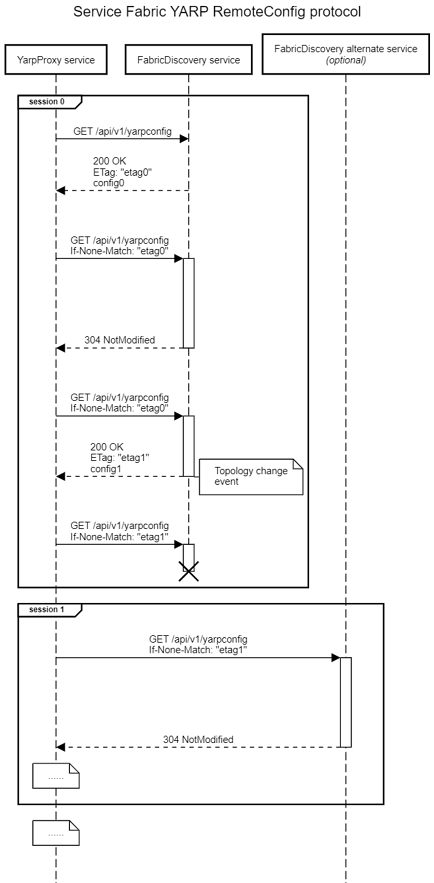

# SFYarp RemoteConfig protocol

## Overview

The Remote Configuration protocol implemented by SFYarp uses standard REST-based API's with long polling and optimistic concurrency headers to achieve the following goals:
* Standard HTTP. Does not require special protocol support (i.e. no gRPC, no WebSockets, etc.)
* Best-effort real-time configuration change updates
* Eventual consistency
* Horizontal scaling / replication of Remote server (i.e. if a session is lost with some external config server, a new session can be established with another instance with minimal overhead, including no need to retransmit known data)

  

(sequence diagram source code at the end of this document)


## Sequence Diagram source:

See [sequencediagram.org](https://sequencediagram.org/).

```
title Service Fabric YARP RemoteConfig protocol

participant "YarpProxy service" as YarpProxy
participant "FabricDiscovery service" as FabricDiscoveryServiceA
participant "FabricDiscovery alternate service\n//(optional)//" as FabricDiscoveryServiceB

linear

group session 0
YarpProxy->FabricDiscoveryServiceA:GET /api/v1/yarpconfig
FabricDiscoveryServiceA-->YarpProxy:200 OK\nETag: "etag0"\nconfig0

space
YarpProxy->FabricDiscoveryServiceA:GET /api/v1/yarpconfig\nIf-None-Match: "etag0"
activate FabricDiscoveryServiceA
space 4
FabricDiscoveryServiceA-->YarpProxy:304 NotModified
deactivate FabricDiscoveryServiceA

space
YarpProxy->FabricDiscoveryServiceA:GET /api/v1/yarpconfig\nIf-None-Match: "etag0"
activate FabricDiscoveryServiceA
space
note right of FabricDiscoveryServiceA:Topology change\nevent
space -8
FabricDiscoveryServiceA-->YarpProxy:200 OK\nETag: "etag1"\nconfig1
deactivate FabricDiscoveryServiceA

space 1
YarpProxy->FabricDiscoveryServiceA:GET /api/v1/yarpconfig\nIf-None-Match: "etag1"
activate FabricDiscoveryServiceA
space 
destroy FabricDiscoveryServiceA
deactivate FabricDiscoveryServiceA

end

group session 1
YarpProxy->FabricDiscoveryServiceB:GET /api/v1/yarpconfig\nIf-None-Match: "etag1"
activate FabricDiscoveryServiceB
space 4
FabricDiscoveryServiceB-->YarpProxy:304 NotModified
deactivate FabricDiscoveryServiceB

note over YarpProxy:......

end

note over YarpProxy:......
```
